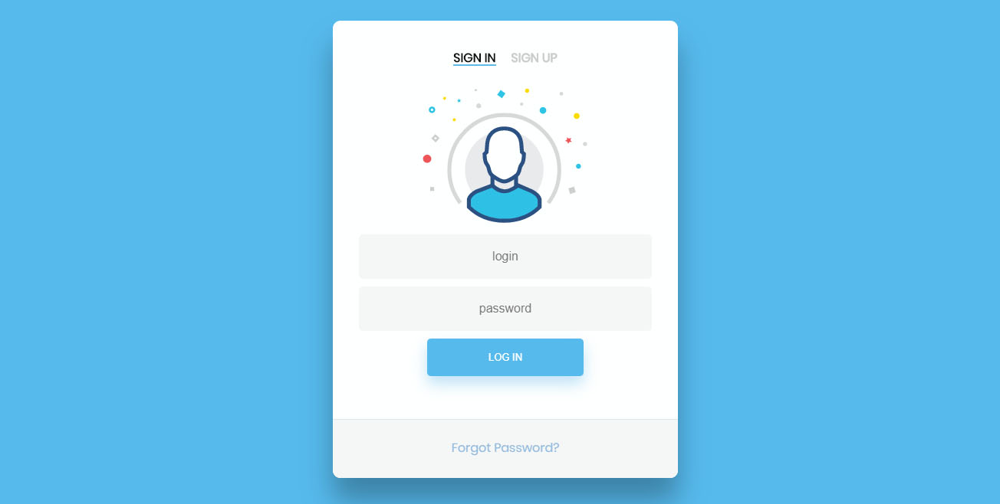
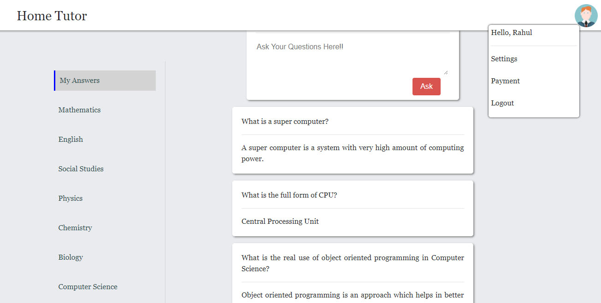

# Home Tutor

<h3>Requirements:</h3>
<ul><li>Django(Python)</li>
<li>HTML, CSS, JAVAScript</li>
<li>Ajax(for asynchronously sending data)</li>
</ul>

<h3>About</h3>
This page was developed as a prototype for a student teacher questionaire system.
The functionalies of the system include:
<ul>
<li>Sign-in/Sign-up page</li>
<li>Student Screen: The home screen where student can ask questions, and see others questions and answers</li>
<li>Teacher Screen: The home screen of teacher where he can see questions and answers related to his specific subject</li>
</ul>

   
<h3>Login Page

<h3>Sign-up page

<h3> Student Screen

Tutor Screen

Payment Screen

